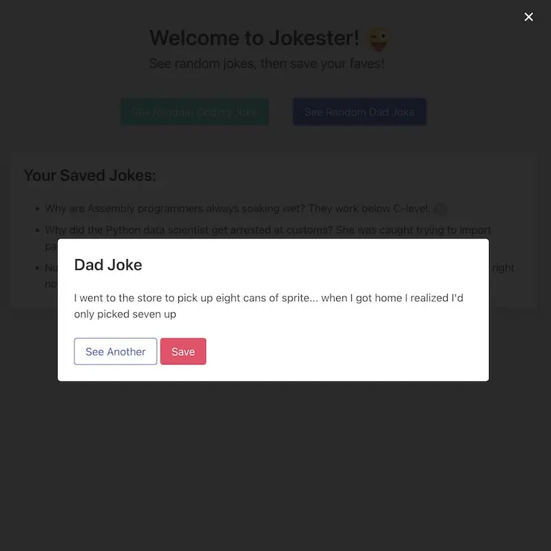

# Jokester

A website which displays random coding and dad jokes, then allows you to save your favorites so you can view them later. Uses Vanilla JavaScript, HTML, and Bulma CSS (decided I'd try a different CSS framework on this one).

